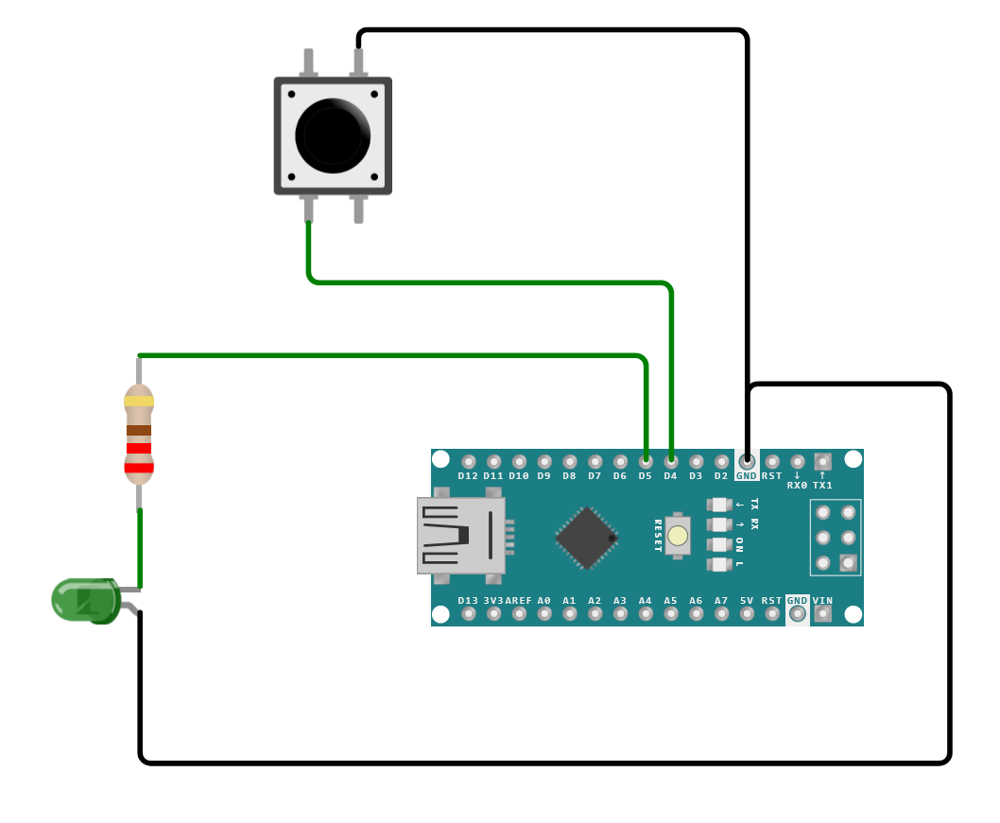

# Tiny USB Wake up

The goal is to create a small usb device which can wake up a PC when receiving a signal over WiFi.

The current implementation is a PoC for the wake up functionality. The board identifies as a HID with remote wake up capabilities. A button triggers the wake up signal and a led shows execution of the wake up command.

### Please note
- In Windows the HID Device must have "Allow this device to wake the computer" flag enabled. (Device Manager -> Select this device -> Power Management)  
- In BIOS the ability to send wake up signals has to be enabled for USB devices.

### Circuit

Made with [Wokwi](https://wokwi.com/)

Based on example sketch from Adafruit: [hid_boot_keyboard.ino](
https://github.com/adafruit/Adafruit_TinyUSB_Arduino/blob/master/examples/HID/hid_boot_keyboard/hid_boot_keyboard.ino)

